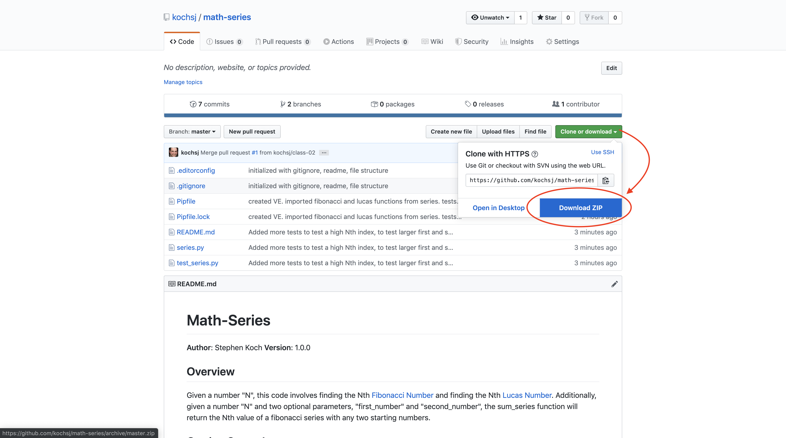

# Django Restful Framework & Docker
**Author**: Stephen Koch

## Overview
In this repository, I am further exploring the python library [Django](https://www.djangoproject.com/) to create web applications using python. My goal is to start by wiring together several views, run a server, be able to request urls, get views as a response, and pass information as JSON between pages.

Here I am also using Docker to create a container for this Django app. [Docker:Windows Install](https://docs.docker.com/docker-for-windows/install/) && [Docker:MacOS Install](https://docs.docker.com/docker-for-mac/install/).

## Getting Started (running Django with Docker)

Because we are using a Docker container, make sure that you have Docker installed:
```
$ docker --version
Docker version 19.03.5, build 633a0ea
```
If you do not: [Docker:Windows Install](https://docs.docker.com/docker-for-windows/install/) && [Docker:MacOS Install](https://docs.docker.com/docker-for-mac/install/).

You need to have the files locally. Click on the green clone or download button and Download ZIP:




In your command line, navigate to this directory:
```
$ cd ~  ##this is your root directory
$ cd Downloads  ##by default: Downloads is a directory inside of your root; and where your file will be downloaded
$ cd wine_api_2.0 ##and now you are in this directory
```
This is the start of a web app and is currently able to run a server and link views together. 
To start the server you will need to build your image from the docker-compose.yml:
```
$ docker-compose up --build
```
## Functionality/Architecture
This web app is for demonstration purposes. It is a Django web app project called wine_api.

We are currently able to run a server and, using the BottleList view, request data from the sqlite database.

## Change Log
Mon Jan 20 2020 21:15:50<br>Wired together a django driven website.
